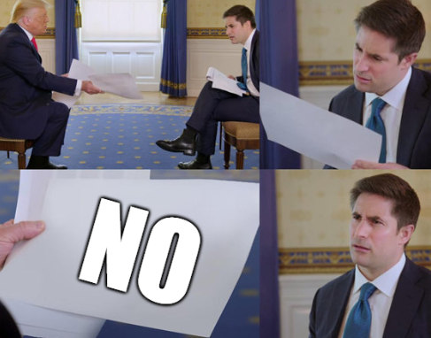
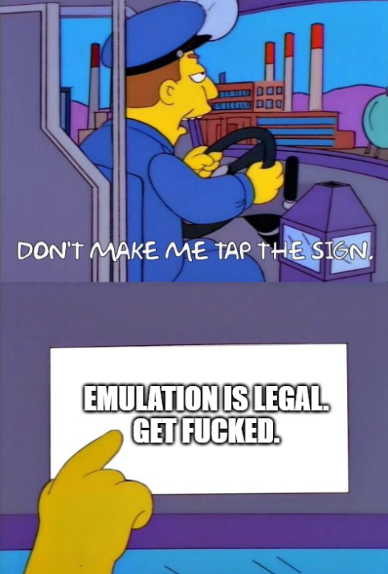

# What is Sabi

In response to Nintendo slapping Yuzu with a fat lawsuit, we're creating Sabi as a new open source emulation platform. The goal for Sabi is, quite honestly, utterly fucking insane. We're aiming to be able to emulate a variety of systems, and we'd like to build for cross-platform compatibility. With that being said, while our goals are extremely ambitious, we're going to start small with the Gameboy — objectively one of the easier platforms to emulate. In addition to this, we're going to focus on emulating Tetris for the Gameboy first. Considering it was one of the first games to be shipped for the Gameboy in North America, there's isn't as large of a technical challenge for this as there would be for something like, say, Pokemon.

Reminder that emulation is legal and is morally correct.

We do not condone piracy.

## Supported Platforms
- Windows [WIP]

## Supported Emulation Devices
- Gameboy [WIP]

## Supported Games
- Tetris (GB) [WIP]

## How To Get Started
It goes without saying that Sabi is a work in progress. I mean, fuck, we barely have a fully emulated GB CPU, we still have a long way to go before we even start rendering graphics or processing audio. That being said, if you'd like to see that we have a working proof of concept, you may follow the instructions below.

1. Clone the repo
2. Make sure you have Rust installed
3. `cargo run`
4. Select your fully-owned, totally-not-pirated, completely-legal ROM
5. Enjoy

## How To Contribute
We'll eventually provide a full contribution guide later, but for now we'll keep things nice and simple.

Since our current goal is to target the Gameboy and to emulate Tetris, we're really only accepting contributions toward this goal. We appreciate all efforts, of course, but please try to respect the current path at hand. Once we can achieve this, then we're more than happy to accept contributions toward other games, platforms, and host systems.

That said, please refer to the branch list for current efforts. At the moment, we have `target-tetris`. *FROM THIS BRANCH*, check out a new branch with whatever feature you're working on.

For example, `target-tetris-ppu`. Make your desired changes, commit things *granularly* but with *balance*, and then send up a PR from your branch (`target-tetris-ppu`) into the main target branch (`target-tetris`).

By "granularly but with balance" we mean this: if you write a commit for every character you type, or if you send a PR with a thousand changes and a single commit that says "some edits" then we will find you, we will forcefully extract your bones, and we will grind them up to use as a calcium supplement for our garden.

Please for the love of fuck, strike a proper balance.

## Why "Sabi"?

Sabi is a direct japanese translation for "rust", the language the emulator is built in. We thought it sounded cool, and we're terrible with names, so we're sticking with this.

## A Warning To Any Lawyer (Especially Nintendo)

Hello, friendo.

While we do genuinely appreciate your keen interest in trying to shut down emulation (for whatever reason), let us remind you of one thing. There is no law against emulation. However, there are laws against piracy. We do not condone piracy, we condone emulation.

Since there are no laws against emulation, this means that it's not explicitly illegal. By extension, this means it is fully legal.

With that in mind, here is our automatic response to every single motherfucker that wants to try to shut this project down:

"Oh but we're gonna take Novohort to court!!"

Lmfao.

"But you need to pay us millions of dollars!!"

Again, lmfao.

"But but but.."

Wanna read the paper again?

This project was inspired partly by the community-wide dissapointment (rage? sadness? idfk) felt by everyone after Yuzu and Citra were forced to shut down due to Nintendo's shenanigans.

But Novohort as an entity honestly doesn't give a fuck. We recognize that everybody will one day cease to exist, so none of this really matters. Tell us to shut down as much as you want. We simply will just... well, not.

## TODO

### CPU Emulation
Interpret and execute GB opcode instructions. Will need to implement a basic fetch-decode-execute cycle that can read and execute a simple set of instructions (e.g., NOP, LD, JP).

### Memory management
Emulate the GB's memory model, including ROM, RAM, and memory-mapped I/O. This will need a focus on ROM loading since we're gonna be loading `.gb` files, and basic read/write functions to memory addresses.

### Graphics rendering
Draw the screen contents by emulating the GB's pixel processing unit. The graphics system can be initially simple, just emulating the drawing of tiles and sprites to a frame buffer. May need to look into Rust graphics libraries such as `pixels` or `minifb` to display the contents of the frame buffer onto the screen.

### Input handling
Capture and process user input as GB button presses. Could use `winit` maybe to help with creating a window and handling input.

### Sound emulation
Eventually replicate the GB's sound synthesis. Look into using something like `cpal` to implement sound.
